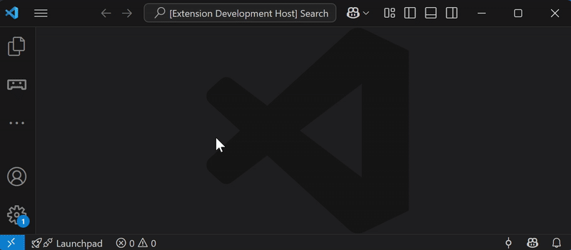

# Pybricks Hub Controller for VSCode

A Visual Studio Code extension to interact with LEGO® Hubs running the Pybricks firmware.

## Features

- Connect and disconnect your Hub  
- Start and stop programs on the Hub  
- Compile and upload Python scripts from your workspace  

## Limitations

- Only custom modules located in the same folder as the main script are supported  
- Package structures and relative imports are **not** currently supported  

## Screenshot

